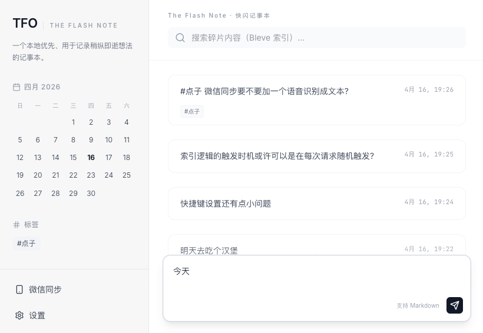

# ⚡ TFO - The Flash Note（快闪记事本）

极简、本地优先的碎片化记事工具。快捷键一键呼出，随手记录灵感；微信消息直达笔记；所有数据以 Markdown 文件存储在本地，无数据库，无云端依赖。


## 项目状态: 开发中

## ✨ 核心优势

- **本地优先，数据自主** — 所有笔记存储在你自己的电脑上，隐私完全可控
- **一键快闪记事** — 全局快捷键呼出窗口，粘贴即保存，捕捉稍纵即逝的想法
- **微信碎片收集** — 给微信 Bot 发消息，自动转为笔记，消息仅经过微信服务器
- **纯 Markdown 文件** — 无数据库，笔记即文件；迁移/同步只需复制文件夹
- **索引可重建** — 搜索索引基于 Markdown 文件构建，随时可从源文件重建，零锁定
- **全文搜索** — 基于 Bleve 的高性能本地全文检索
- **跨平台** — 支持 macOS / Windows / Linux，提供桌面应用与 CLI 两种形态


## 📸 界面预览

### 主界面



### 快闪记事


### 微信 Bot


## 🚀 快速开始

### 方式一：下载预编译版本（推荐）

从 [Releases](https://github.com/libi/tfo/releases) 下载对应平台的二进制，解压即用。

**MacOS**：打开 `TFOApp.app`，应用常驻菜单栏  
**Windows**：运行 `tfo-desktop.exe`，应用常驻系统托盘  
**Linux/Cli**：运行 `tfo`，浏览器打开 `http://localhost:8080`

### 方式二：从源码构建

#### 前置条件

- Go 1.25+
- Node.js 18+
- macOS 桌面版额外需要 Xcode（用于 Swift 编译）

#### 开发模式

```bash
# 1. 启动前端开发服务器
cd frontend && npm install && npm run dev

# 2. 另开终端，启动后端
go run ./cmd/tfo
```

前端默认运行在 `http://localhost:3000`，后端 API 在 `http://localhost:8080`。

#### 生产构建

```bash
# 构建 CLI（全平台）
./scripts/build.sh cli

# 构建桌面应用（macOS）
./scripts/build.sh desktop --os darwin

# 构建桌面应用（Windows）
./scripts/build.sh desktop --os windows

# 全量构建
./scripts/build.sh all
```

构建产物输出到 `dist/` 目录。

### 使用流程

1. **启动应用** — 双击桌面应用或终端运行 CLI
2. **快闪记事** — 按 `Alt+S`（可自定义）呼出快捷输入窗口，输入内容后回车保存
3. **浏览笔记** — 在 Web 界面查看、搜索、编辑所有笔记
4. **微信收集**（可选）— 在设置中配置微信 Bot，之后发给 Bot 的消息自动保存为笔记
5. **数据迁移** — 复制数据文件夹到新设备即可，搜索索引会自动重建

## ⚙️ 配置

配置文件位于数据目录下的 `.config.json`：

| 配置项 | 说明 | 默认值 |
|--------|------|--------|
| `dataDir` | 数据目录路径 | - |
| `hotkeyQuickCapture` | 快闪记事快捷键 | `Alt+S` |
| `wechat.enabled` | 启用微信 Bot | `false` |
| `wechat.baseUrl` | 微信 Bot 服务地址 | - |
| `indexRebuildOnStart` | 启动时重建搜索索引 | `false` |


## 🏗️ 架构

```
┌─────────────┐     ┌──────────────┐
│  Desktop App│     │   CLI (tfo)  │
│ (系统托盘)   │     │  (终端运行)   │
└──────┬──────┘     └──────┬───────┘
       │                   │
       └───────┬───────────┘
               ▼
      ┌─────────────────┐
      │   HTTP Server    │  ← Gin
      │   (API + SPA)   │
      └────────┬────────┘
               │
  ┌────────────┼────────────┐
  ▼            ▼            ▼
┌──────┐  ┌────────┐  ┌─────────┐
│ Note │  │ Search │  │ Channel │
│Service│  │(Bleve) │  │(WeChat) │
└──┬───┘  └────────┘  └─────────┘
   ▼
┌──────────┐
│ Markdown │  ← 数据文件夹
│  Files   │
└──────────┘
```

**后端**：Go — Gin HTTP 框架 / Bleve 全文搜索 / fsnotify 文件监听  
**前端**：Next.js + React + Tailwind CSS，构建后嵌入二进制  
**桌面**：系统托盘 + 全局快捷键（macOS 使用 Swift 原生壳）

## 📁 项目结构

```
cmd/
  tfo/         — CLI 入口
  desktop/     — 桌面应用入口（系统托盘 + 全局快捷键）
    macos/     — macOS 原生 Swift 包装
frontend/      — Next.js 前端（构建产物嵌入 Go 二进制）
internal/
  app/         — 应用生命周期管理
  note/        — 笔记 CRUD、Markdown 解析
  search/      — Bleve 全文索引与搜索
  channel/     — 消息通道（微信 Bot 适配）
  config/      — 配置管理
  server/      — Gin HTTP API
  watcher/     — 文件变更监听，自动更新索引
pkg/mdutil/    — Markdown 工具函数
scripts/       — 构建脚本
```

## 📄 License

MIT
